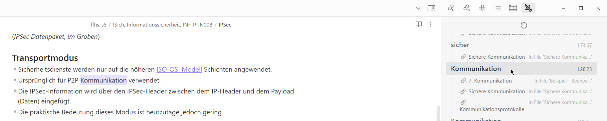
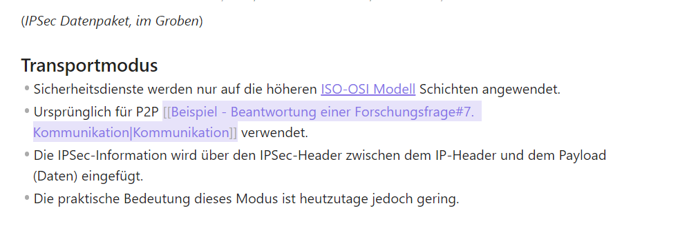

# 🏹 Crossbow

Crossbow is a plugin for [Obsidian](https://obsidian.md).
Its purpose is to provide crossreference suggestions on Notes that you've written.
With that, your knowledge graph will gain some desperatly needed edges - it'll become more meaningful and interconnected.

## How to use

Just open the crossbow sidebar by clicking on the crossbow icon. All the suggestions will appear within the sidebar.
Clicking on an entry will navigate to the word occurance in the currently open editor.

By clicking on a suggestion within the entry, crossbow will insert a link with the appropriate displayname.

## How to install

*(Crossbow is currently not listed in the community plugins - it's not ready yet)*
1. Clone this repo.
2. `npm i` or `yarn` to install dependencies
3. `npm run build` to build crossbow.
4. Copy over `main.js`, `styles.css`, `manifest.json` to your vault `VaultFolder/.obsidian/plugins/your-plugin-id/`.

## Dev Notes

### Roadmap

* [ ] General UX Improvement
* [ ] Add Integration & Unit Tests
* [ ] Push to community plugin list

### Releasing new releases

- Update your `manifest.json` with your new version number, such as `1.0.1`, and the minimum Obsidian version required for your latest release.
- Update your `versions.json` file with `"new-plugin-version": "minimum-obsidian-version"` so older versions of Obsidian can download an older version of your plugin that's compatible.
- Create new GitHub release using your new version number as the "Tag version". Use the exact version number, don't include a prefix `v`. See here for an example: https://github.com/obsidianmd/obsidian-sample-plugin/releases
- Upload the files `manifest.json`, `main.js`, `styles.css` as binary attachments. Note: The manifest.json file must be in two places, first the root path of your repository and also in the release.
- Publish the release.

> You can simplify the version bump process by running `npm version patch`, `npm version minor` or `npm version major` after updating `minAppVersion` manually in `manifest.json`.
> The command will bump version in `manifest.json` and `package.json`, and add the entry for the new version to `versions.json`

### Adding to the community plugin list

- Check https://github.com/obsidianmd/obsidian-releases/blob/master/plugin-review.md
- Publish an initial version.
- Make sure you have a `README.md` file in the root of your repo.
- Make a pull request at https://github.com/obsidianmd/obsidian-releases to add your plugin.

### API Documentation

See https://github.com/obsidianmd/obsidian-api
