# 🏹 Crossbow

Crossbow is a plugin for [Obsidian](https://obsidian.md).

Boost your Obsidian note-taking workflow with this plugin that offers handy suggestions for links to headings, tags, and files, helping you effortlessly weave a web of interconnected notes and supercharge your note graph.

## How to use

Just open the crossbow sidebar by clicking on the crossbow icon in the ribbon. All the suggestions will appear within the sidebar.

### Applying suggestions

Clicking on a suggestion in the sidebar will show you a list of occurrences of the word in the current note.
Clicking on one of the occurences will scroll to it and show you a list of matched cache items that you can link to. These matches are ranked, based on the quality of the match.

You can apply a match by clicking the appropriate icon next to the match:

which will insert the following link:

> In Obsidian a pipe (`|`) inside a link denotes the "display text" of the link. This means that the text after the pipe will be shown instead of the link.

### Temporarily disabling suggestions

You can temporarily disable suggestions by righ-clicking the crossbow icon of the crossbow view and selecting "Close". This will close the sidebar and disable suggestions. To re-enable suggestions, just click the crossbow icon in the ribbon again.

## Under the hood

### What is a suggestion?

A suggestion is a word in your active editor (current note) that can be linked to a **heading**, a **tag**, or a **file** in your vault:

Crossbow leverages Obsidian's internal cache and does not manually parse your vault.
To find matches in your current note, it strips the active editors content of any markdown syntax and then searches for suggestion in the stripped content.

### A word about how suggestions are matched

Crossbow is opinionated, but also configurable about how it creates suggestions.
As of 1.1.1 the process of filtering looks like this:

Initially, it gathers all the **word**s in the active editor (current note) and all the cache items (Identified by their **cache key**) in the vault.
Then, it follows a simple process for each **word** and **cache key** to create a suggestion:

```mermaid
graph TD
    START((Start))
    Q_ACT_EDITOR["1. <b>Cache key</b> stems from active editor? <br>Configurable, see setting <i>Make suggestions to items in the same file</i>"]
    Q_EXCT_MATCH["2. Exact match (case sensitive) between <b>word</b> and <b>cache key</b>?"]
    Q_WORD_IGNOR["3. <b>Word</b> is on ignore list? (case sensitive) <br>Configurable, see setting <i>Ignored words</i>"]
    Q_WORD_SHORT["4. <b>Word</b> is too short? (Currently fixed to 3 chars)"]
    Q_CKEY_SHORT["5. <b>Cache key</b> is too short? <br>Configurable, see setting <i>Minimum word length of suggestions</i>"]
    Q_IS_SUBSTRG["6. <b>Word</b> is a substring of <b>cache key</b> or vice versa?"]
    Q_WORD_UCASE["7. <b>Word</b> starts with an uppercase letter? <br>Configurable, see setting <i>Ignore occurrences which start with a lowercase letter</i>"]
    Q_CKEY_UCASE["8. <b>Cache key</b> starts with an uppercase letter? <br>Configurable, see setting <i>Ignore suggestions which start with a lowercase letter</i>"]
    Q_MATCH_INSV["9. Exact match (case insensitive) between <b>word</b> and <b>cache key</b>?"]
    Q_LEN_SIMILR["10. Similarity of less than 20% length-wise between <b>word</b> and <b>cache key</b>?"]

    STOP((STOP))

    SUCCESS_1["Add as very good suggestion (🏆)"]
    SUCCESS_2["Add as good suggestion (🥇)"]
    SUCCESS_3["Add as mediocre suggestion (🥈)"]
    SUCCESS_4["Add as 'not-very-good' suggestion (🥉)"]


    START --> Q_ACT_EDITOR

    Q_ACT_EDITOR -- Yes --> STOP
    Q_ACT_EDITOR -- No --> Q_EXCT_MATCH

    Q_EXCT_MATCH -- Yes --> SUCCESS_1 --> STOP
    Q_EXCT_MATCH -- No --> Q_WORD_IGNOR

    Q_WORD_IGNOR -- Yes --> STOP
    Q_WORD_IGNOR -- No --> Q_WORD_SHORT

    Q_WORD_SHORT -- Yes --> STOP
    Q_WORD_SHORT -- No --> Q_CKEY_SHORT

    Q_CKEY_SHORT -- Yes --> STOP
    Q_CKEY_SHORT -- No --> Q_IS_SUBSTRG

    Q_IS_SUBSTRG -- Yes --> STOP
    Q_IS_SUBSTRG -- No --> Q_WORD_UCASE

    Q_WORD_UCASE -- Yes --> STOP
    Q_WORD_UCASE -- No --> Q_CKEY_UCASE

    Q_CKEY_UCASE -- Yes --> STOP
    Q_CKEY_UCASE -- No --> Q_MATCH_INSV

    Q_MATCH_INSV -- Yes --> SUCCESS_2 --> STOP
    Q_MATCH_INSV -- No --> Q_LEN_SIMILR
    Q_LEN_SIMILR -- Yes --> SUCCESS_4 --> STOP
    Q_LEN_SIMILR -- No --> SUCCESS_3 --> STOP
```

Keep in mind that these steps are processed in order. For example, take a look at the length filter in step 10. At this point, the **word** and **cache key** are already a substring of each other (step 6), meaning that this step adds things like "donut" and "donut hole punching machine manual". Not things that are in general vastly different to each other, which would create a lot of false positives.

## How to install manually

1. Clone this repo.
2. `npm i` or `yarn` to install dependencies
3. `npm run build` to build crossbow.
4. Copy `main.js`, `styles.css`, `manifest.json` into a folder called `crossbow` in your vault's `.obsidian/plugins/` folder.

If you like this plugin, please consider:
 
 

